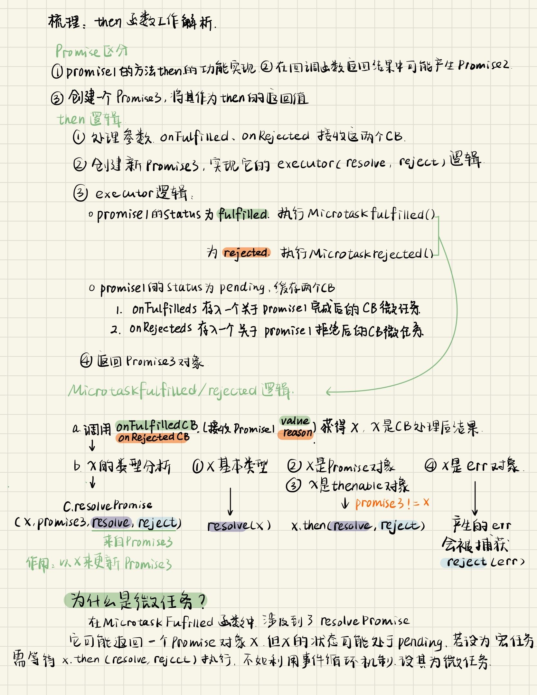

### 01-deepClone

对深拷贝的理解：需要理解深拷贝的含义。当我们对一个对象进行复制时，不仅仅是复制它的地址，而是要复制所有它所引用的对象，为这些对象创建新的对象。

1. 基本思路：分类讨论+递归
- 设计思路：如果是基本类型直接返回值，是对象则需要为每一个属性开辟新的空间
- 实现方式：而对于每一个属性都需要判断类型（对象{},数组[],js基本数据类型），所以使用递归
2. 循环引用问题
- 设计思路：自己引用自己的对象会使得递归变为死循环，而实际上引用自己只需要开辟一份存储空间并且保存该空间地址，因此对于每个对象复制前都判断它是否之前复制过，如果被复制过直接指向之前的这个空间即可。
- 实现方式：使用weakmap实现对已复制对象地址的保存。weakmap的好处是当一个对象的属性被移除后，如果这个属性的值没有被其他变量或对象引用，那么这个值所对应的对象就会成为垃圾对象，等待垃圾回收器的回收。当这个对象被回收后，它所对应的键值对也会被 `WeakMap` 自动删除。

```js
function deepClone(target,map=new weakMap()){
    if(typeof target=="object"){
        let object=Array.isArray(target)?[]:{};
        if(map.get(target)){
            return map.get(target);
        }
        map.set(target,object);
        for(let key in target){
            object[key]=deepClone(target[key],map);
        }
        return object;
    }
    else{
        return target;
    }
}
```


### 02-call、apply、bind、new

【call、apply、bind】

- 对call、apply、bind的理解：三者实际上是Function的成员函数，让函数在调用时指定this指向的对象。实现了让不同的对象（context）可以将某个非成员函数作为自己的方法函数使用。

- 三者实现上的区别

|          | call                                                  | apply                                                 | bind                                      |
| -------- | ----------------------------------------------------- | ----------------------------------------------------- | ----------------------------------------- |
| 接收参数 | func.call(context,参数1,...,参数n)                    | func.apply(context,[参数数组])                        | func.bind(context,参数1,...,参数n)        |
| 返回情况 | 让this指向context，直接调用func，并给返回func的返回值 | 让this指向context，直接调用func，并给返回func的返回值 | 返回func函数的包装，同时让this指向context |

- call、apply实现思路概述

  1. 参数校验：这个环节的目的是为了保证传入的参数是我们期待的格式，这样能够保证参数得到正确的处理。具体来说校验工作包括：

     - 是否传递了该参数，如果没有参数是否设置默认值
     - 参数是否有类型的要求，如果有则要进行判断，符合要求才能继续执行

     需要注意的是，参数不一定只出现在一开始，也可能是在中间产生，传递给其他函数。不论参数出现在哪里都需要注意适时的校验。

  2. 绑定和解绑：根据实现目的，要让func成为context的成员函数，因此有绑定和解绑的过程。当然在绑定了之后需要对函数进行一个调用，之后再解绑还原。
     - 这里有一个细节在于func函数名可能会和context本身的成员函数同名，因此我们使用一个symbol对象给func进行重命名。

- bind实现思路概述

  实际上bind就是使用一个函数包装apply函数，并将这个函数作为返回值，由使用者决定这个函数调用的时机。

  - bind接受的参数和返回函数接受的参数都最终作为func的参数来执行

```js
Function.prototype.myCall=function(context){
    //绑定在函数的原型上，myCall应该只能被函数对象使用，无需判断
    // if(typeof this!=="function")
    //     throw new Error("can only be called by a function")
    const mycontext=context||Window;
    let args=[...arguments].slice(1);
    const func=Symbol();
    mycontext.func=this;
    let res;
    if(arguments[1])
    res=mycontext.func(...args);
    else
    res=mycontext.func();
    delete mycontext.func;
    return res;

}
//myApply和myCall的区别只在于参数调用上的不同
Function.prototype.myApply=function(context){
    const mycontext=context||Window;
    let args=arguments[1];
    if(!Array.isArray(args))
        throw new Error("myApply的参数需要放在数组中传入")
    const func=Symbol();
    mycontext.func=this;
    let res;
    if(args){
        res=mycontext.func(...args);
    }else{
        res=mycontext.func();
    }
    delete mycontext.func;
    return res;
}
//myBind实现
//存在的问题：如果返回的函数作为构造函数，不会返回一个新的对象
Function.prototype.myBind=function(context) {
    const args=[...arguments].slice(1);
    const func=this;
    return function(){
        return func.apply(context,args.concat([...arguments]))
        
    }
    
}
//改进
Function.prototype.myBind=function(context) {
    const args=[...arguments].slice(1);
    const func=this;
    return function Fn(){
        if(this instanceof Fn){
            return func.apply(this,args.concat([...arguments]))
        }else{
            return func.apply(context,args.concat([...arguments]))
        }     
    }   
}

```


【new】

- new操作的本质目的：这里涉及到原型链的相关知识。主要是需要创建一个新对象，通过构造函数确定对象的原型对象，调用构造函数实现对新对象的初始化工作，并将这个新对象返回。

  而这里需要注意的问题就是构造函数本身不是新对象的成员函数，因此需要借助apply方法，让新对象可以调用初始化函数从而实现自身的初始化

  ```js
  //使用myNew函数模拟new运算符的功能
  function myNew(context){
      if(typeof context !== 'function')
      throw new Error("非构造函数")
      let obj = new Object();
      obj.__proto__=context.prototype;
      let res = context.apply(obj,[...arguments].slice(1));
      if (res){
          return res;
      }
      return obj;
  }
  ```

### 03-Promise

#### Promise的理解

promise是JavaScript用来完成异步操作的一个对象，它使得js中的异步代码更简洁易读易于维护。

#### Promise的特点

- Promise对象有三个状态：pending、fulfilled、rejected。这些状态设置的目的是为了能够在恰当的时机调用相应的回调函数。
- Promise的回调：Promise使用then和catch方法分别接收Promise处于fulfilled和rejected状态时，设定好的的回调函数。
- Promise的链式调用：Promise的then方法返回一个新的Promise对象，这方便用户将多个异步操作组合在一起，易于阅读和管理。

#### Promise的设计

整体来说细节比较多，这里首先针对几个值得讨论的点做一些理解阐述

1. Promise的核心特性和方法
   - resolve、reject方法，用来改变Promise对象的状态，由pending转为fulfilled或者rejected
   - status变量，用来记录Promise对象的状态，状态有pending、fulfilled、rejected三种
   - value、reason变量，分别用来记录结果和错误
   - then、catch方法，分别用来接收fulfilled、rejected状态下需要执行的回调函数onFulfilledCallback、onRejectedCallback
   - onFulfilledCallbacks，onRejectedCallbacks数组，分别用来储存fulfilled、rejected状态下需要执行的回调函数，并且在Promise
   - executor执行器，使用resolve、reject方法作为参数，由用户设定，用户可以通过实现executor执行器中的逻辑，来改变Promise可能的状态变化

2. then的工作流程梳理

   

3. Promise的常用静态方法介绍：resolve、reject、all、race

- resolve，用来包装非Promise对象，将其变为fulfilled的Promise对象，以及传递Promise对象
- reject，用来包装非Promise对象，将其变为rejected的Promise对象
- all，用来返回一组Promise对象的处理结果，或者返回第一个错误（返回一个Promise对象，值存储在它的value或者reason属性中）
- race，用来返回一组Promise对象中第一个返回的处理结果，或者它的错误（返回一个Promise对象，值存储在它的value或者reason属性中）

#### Promise的实现

```js
// MyPromise.js

// 先定义三个常量表示状态
const PENDING = 'pending';
const FULFILLED = 'fulfilled';
const REJECTED = 'rejected';

// 新建 MyPromise 类
class MyPromise {
  constructor(executor){
    // executor 是一个执行器，进入会立即执行
    // 并传入resolve和reject方法
    try {
      executor(this.resolve, this.reject)
    } catch (error) {
      this.reject(error)
    }
  }

  // 储存状态的变量，初始值是 pending
  status = PENDING;
  // 成功之后的值
  value = null;
  // 失败之后的原因
  reason = null;

  // 存储成功回调函数
  onFulfilledCallbacks = [];
  // 存储失败回调函数
  onRejectedCallbacks = [];

  // 更改成功后的状态
  resolve = (value) => {
    // 只有状态是等待，才执行状态修改
    if (this.status === PENDING) {
      // 状态修改为成功
      this.status = FULFILLED;
      // 保存成功之后的值
      this.value = value;
      // resolve里面将所有成功的回调拿出来执行
      while (this.onFulfilledCallbacks.length) {
        // Array.shift() 取出数组第一个元素，然后（）调用，shift不是纯函数，取出后，数组将失去该元素，直到数组为空
        this.onFulfilledCallbacks.shift()(value)
      }
    }
  }

  // 更改失败后的状态
  reject = (reason) => {
    // 只有状态是等待，才执行状态修改
    if (this.status === PENDING) {
      // 状态成功为失败
      this.status = REJECTED;
      // 保存失败后的原因
      this.reason = reason;
      // resolve里面将所有失败的回调拿出来执行
      while (this.onRejectedCallbacks.length) {
        this.onRejectedCallbacks.shift()(reason)
      }
    }
  }

  then(onFulfilled, onRejected) {
    const realOnFulfilled = typeof onFulfilled === 'function' ? onFulfilled : value => value;
    const realOnRejected = typeof onRejected === 'function' ? onRejected : reason => {throw reason};

    // 为了链式调用这里直接创建一个 MyPromise，并在后面 return 出去
    const promise2 = new MyPromise((resolve, reject) => {
      const fulfilledMicrotask = () =>  {
        // 创建一个微任务等待 promise2 完成初始化
        queueMicrotask(() => {
          try {
            // 获取成功回调函数的执行结果
            const x = realOnFulfilled(this.value);
            // 传入 resolvePromise 集中处理
            resolvePromise(promise2, x, resolve, reject);
          } catch (error) {
            reject(error)
          } 
        })  
      }

      const rejectedMicrotask = () => { 
        // 创建一个微任务等待 promise2 完成初始化
        queueMicrotask(() => {
          try {
            // 调用失败回调，并且把原因返回
            const x = realOnRejected(this.reason);
            // 传入 resolvePromise 集中处理
            resolvePromise(promise2, x, resolve, reject);
          } catch (error) {
            reject(error)
          } 
        }) 
      }
      // 判断状态
      if (this.status === FULFILLED) {
        fulfilledMicrotask() 
      } else if (this.status === REJECTED) { 
        rejectedMicrotask()
      } else if (this.status === PENDING) {
        // 等待
        // 因为不知道后面状态的变化情况，所以将成功回调和失败回调存储起来
        // 等到执行成功失败函数的时候再传递
        this.onFulfilledCallbacks.push(fulfilledMicrotask);
        this.onRejectedCallbacks.push(rejectedMicrotask);
      }
    }) 
    
    return promise2;
  }
    catch(onRejectedCB){
        this.then(null,onRejectedCB);
    }

  // resolve 静态方法
  static resolve (parameter) {
    // 如果传入 MyPromise 就直接返回
    if (parameter instanceof MyPromise) {
      return parameter;
    }

    // 转成常规方式
    return new MyPromise(resolve =>  {
      resolve(parameter);
    });
  }

  // reject 静态方法
  static reject (reason) {
    return new MyPromise((resolve, reject) => {
      reject(reason);
    });
  }
  //all
  static all(promises){
    const N=promises.length
    const res=[];
    let count=0;
    return new MyPromise((resolve,reject)=>{
        promises.forEach((promise,i)=>{
            MyPromise.resolve(promise).
            then((value)=>{
                res[i]=value;
                count++;
                if(count===N)
                    resolve(res)
            }).catch(reject)
            
        })
    })
  }
    //race
 static race(promises){
     return new MyPromise((resolve,reject)=>{
         promises.forEach((promise)=>{
             MyPromise.resolve(promise).
                 then(resolve,reject)
         })
     })
 }
}


function resolvePromise(promise2,x,resolve,reject){
  if(promise2===x)
      throw new TypeError("Chaining cycle detected for promise #<Promise>")
  if(typeof x==='object'||typeof x ==='function'){
      if(x===null)
          resolve(x);
      let then;
      try{
         then=x.then 
      }
      catch(err){
          reject(err)
      }
      if(typeof then==='function'){
          x.then(resolve,reject)
      }
      else{
          resolve(x)
      }
  }else{
      resolve(x)
  }
}

```

### 04-防抖

#### 防抖 (debounce)概念

在一段时间内连续地触发同一个事件，只执行第一次或者最后一次触发操作。适用于需要等待用户停止操作后才执行的操作，比如输入框搜索功能。

#### 防抖的实现

debounce(handler,wait,immediate)

- handler——需要进行防抖处理的事件处理程序
- wait——限定不能连续触发事件的时间段
- immediate——在时间段内，设定执行第一次操作还是最后一次操作

返回值：返回防抖函数包装好的事件处理程序函数，也可以理解为新的事件处理程序

【基本功能】

1. 使用定时器：

   在debounce函数中声明一个定时器变量timer（未设置状态timer==null）

   - case1-执行最后一次：如果timer处于未设置状态，就设置一个wait时间后触发的handler；==如果timer处于设置状态，就清除当前timer==，再设置一个wait时间后触发的handler的计时器
   - case2-执行第一次：如果timer处于未设置状态,就调用handler，并且在wait时间后将timer重新设置为未设置状态；==如果timer处于设置状态，就清除当前timer==，并且设置一个wait时间后将timer重新设置为未设置状态的计时器

2. 使用immediate参数：目的是让使用者通过设定参数就可以决定执行的时间点，而不需要编写两个debounce函数

   可以总结发现，case1和case2中当timer处于设置状态时，都需要把当前的计时器清空，可以把这个逻辑提取出来放在前面，之后再通过参数immediate进行分支判断，执行case1或者case2的逻辑

【实现细节】

1. this

   在事件处理程序中，this必须指向事件对象（某个页面上的dom元素），而当使用了debounce封装事件处理程序，其中原本的处理程序（handler）this不指向事件对象，而是指向了window，导致了问题。因此需要将debounce的返回的新处理程序所获取到的this，通过bind、apply绑定到初始的执行函数handler上

2. event

   事件处理程序（事件发生后的回调函数）有event事件对象作为参数。而当debounce封装了事件处理程序之后，新处理程序的参数（包含event对象）没有传递给原本的处理程序（handler），导致原本处理程序中对于event的使用失效，所以要把arguments对象也通过bind、apply绑定到初始的执行函数handler上

3. 取消按钮

   根据立即执行的设计思路，如果等待timer被重置需要等到最后一次操作经过n时间，所以给防抖封装增加一个方法，直接将timer赋值为null，调用它后处理程序在事件发生后立即被调用。

【代码实现】

```js
function debounce(func,wait,immediate){
    let timer;
    return function(){
        //container
        const context=this;
        const args=arguments;
        let res;
        if(timer) 
            clearTimeout(timer);
        if(immediate){
            let nowCall=!timer;
            //事件触发wait时间后，timer回到最初状态，最后一次周期内触发的wait之后，timer清空
            timer=setTimeout(function(){timer=null},wait);
            //第一次触发，调用处理程序
            if(nowCall){
                //可能会有返回值，在这里返回
                res=func.apply(context,args);
            }
        }
        else{
            //指定func的this指向container
            timer=setTimeout(func.bind(context,args),wait);
            
        }
            console.log("newHandler的this指向：",this)
            return res;
    }

}
```


学习来源：

https://github.com/mqyqingfeng/Blog/issues/22

#### 防抖的应用场景

1. 窗口大小调整时触发重排：因为用户自己可能也需要多次调整大小找到最适合的尺寸。
2. 避免重复提交、点击事件：在网站表单提交时，用户可能会多次点击提交按钮，导致多次提交表单。尤其时当页面的响应比较慢，用户自己也不确定是否提交成功，容易发生多次提交。

### 05-节流

节流 (throttle)概念：每隔一段时间执行一次回调函数，比如每 100 毫秒执行一次，而不管事件触发频率。适用于需要频繁触发事件但又不需要每次都执行回调函数的情况，比如滚动事件、鼠标移动事件等。

1. 时间戳

   记录上一次触发的时间戳和下一次触发的时间戳，以此计算出时间差，根据时间差和n时间之间的比较，决定是否调用处理程序。保证在n时间内只调用一次处理程序。

   在装饰器中需要保存记录上一次时间戳的变量。

   特点：立即执行

2. 定时器

   若定时器为null，设定新的定时器在n时间后处理程序调用，并且将定时器重置为null

   特点：需要等待n时间才会触发

3. 新思路

   事件触发后...

   1. 计算剩余时间remainings，如果remainings<=0，那么可以使用处理程序了，同时需要记录previous和重置定时器
   2. 如果n时间内不存在定时器，同时剩余时间还有，那么我们设定一个定时器，在remaings时间后，我们调用程序同时记录previous和重置定时器

4. 头尾问题（待学习）

   在上述设定中，在n时间内触发事件，开始时会调用处理程序，remaings时间后也会调用处理程序，因此设计leading和tailing两个属性来控制调用处理程序的时机

学习来源：https://github.com/mqyqingfeng/Blog/issues/26


### 06-instanceof的实现

需要用到原型链的基础知识，概括如下：

自顶向下来看：

1. 顶层对象：js中设计了Object.prototype和它的构造函数Object
   - 对象原型没有进一步的源头了，所以`Object.prototype.__proto__==null`
   - 对象构造器是一个构造器对象，所以`Object.__proto__==Function.prototype`
2. 顶层构造器：js中设计了Function.prototype和它的构造函数Function
   - 由于构造器原型本身也是对象，`Function.prototype.__proto__==Object.prototype`
   - 函数构造器是一个构造器对象，所以`Function.__proto__==Function.prototype`

3. 普通对象：每个对象都有`__proto__`属性（原型链属性，js中的非标准属性，可以使用Object.getPrototypeOf获得），它指向对象的原型对象，也可以理解为是对象的构造函数的prototype所指向的对象。
4. 构造器：构造器不仅有`__proto__`属性，同时也有`prototype`属性，前者指向构造器作为一个对象本身，这个对象的原型，后者指向构造器构造出来的对象的原型对象。
5. 对象原型：对象原型包含了对象可以使用的属性和方法。

### 07-数组扁平化

学习来源：[JavaScript专题之数组扁平化 · Issue #36 · mqyqingfeng/Blog (github.com)](https://github.com/mqyqingfeng/Blog/issues/36)

1. 数组扁平化的本质是通过递归

2. 为了让扁平化函数能够为其他的工具函数更好地提供扁平化功能，

   设置了strict属性，可以在扁平化的过程中去除那些非数组的元素

   设置了shallow属性，可以只扁平化一层，而不进行递归

3. 应用场景，比如让`[1,2,[3,4,5],[6,5,7]]`转化为`[3,4,5,6,5,7]`就可以设置strict=true，shallow=true
### 08-reduce的实现
实际上Array的函数，接收处理函数的回调函数，回调函数就像一套处理程序，给数组迭代的处理，最后返回想要的结果，其中很多中间量是保存在Array函数中的

### 09-去重

去重是指从一个集合中删除重复的元素，以便只保留独特的元素。集合可以是数组、对象、字符串等。

本例中主要实现了三种去除数组中重复元素的方法。